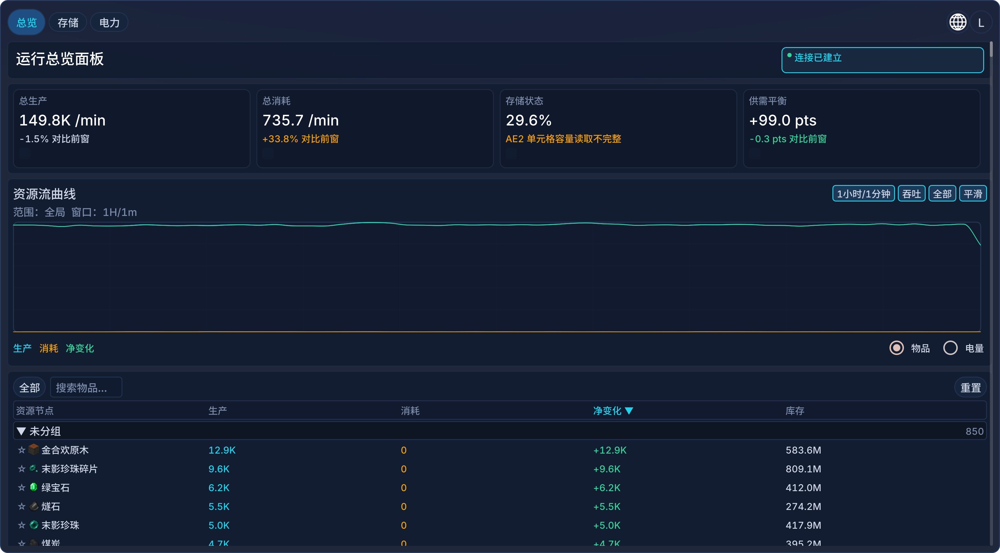
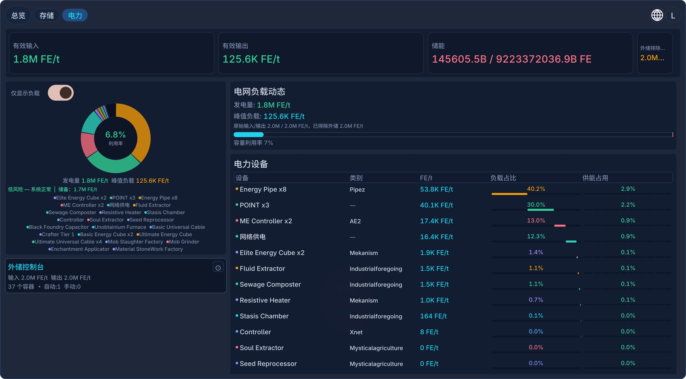
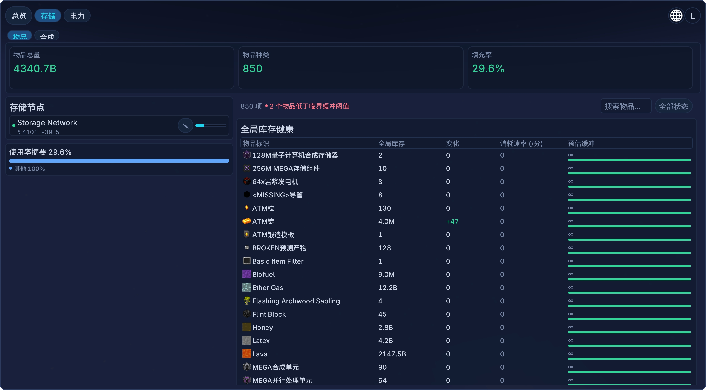
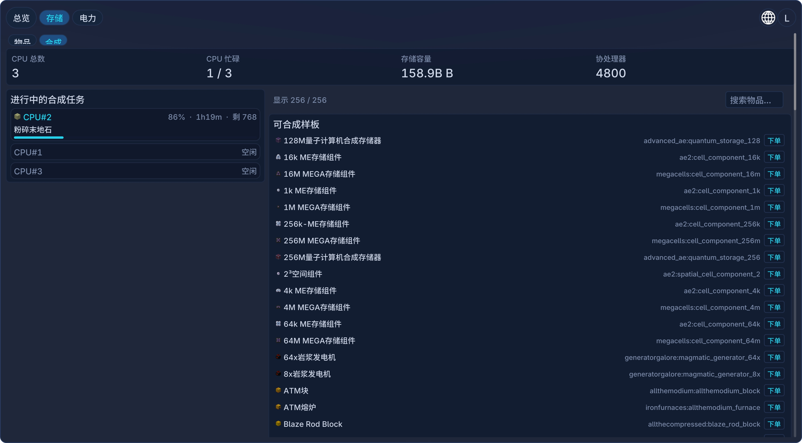
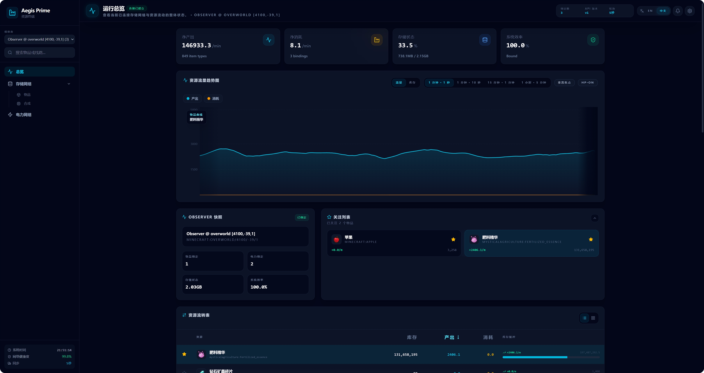
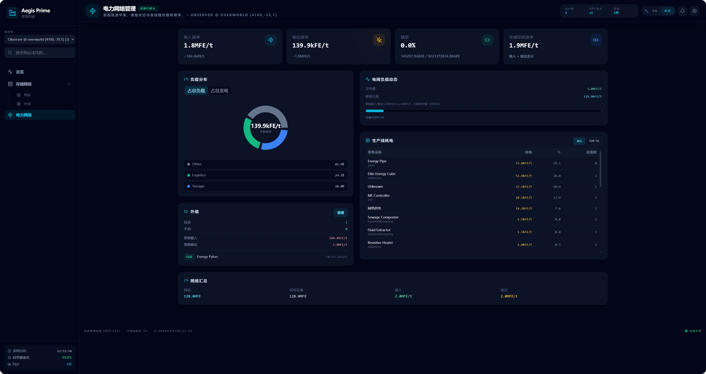
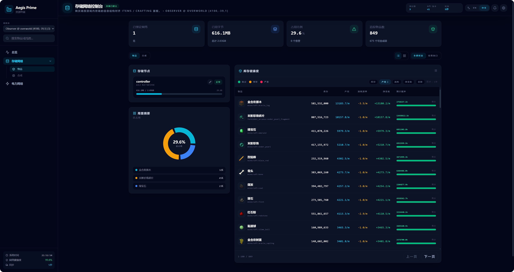
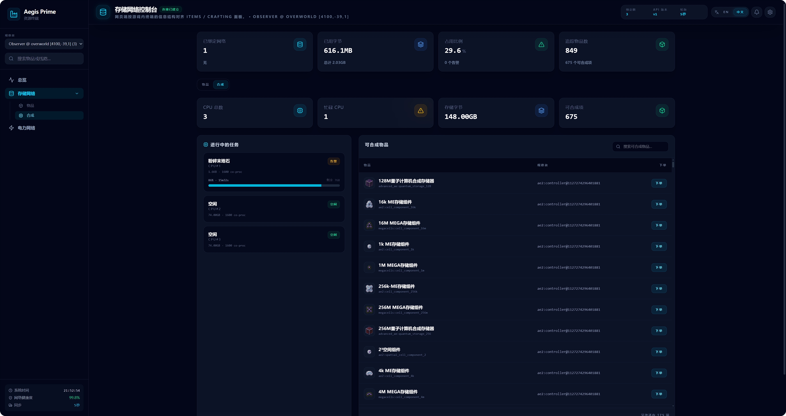

# Resource Observer

[](https://neoforged.net/)
[](https://adoptium.net/)
[](LICENSE)
[](#)
[](#)

**Resource Observer** 是一个 Minecraft NeoForge 模组，让你在游戏内或浏览器中实时监控 AE2 存储网络和 Flux 能量网络的数据。

---

## 功能

- **游戏内仪表盘（ModernUI ）：** 总览 / 存储网络 / 电力网络三个标签页，数据实时刷新
- **Web 仪表盘：** 游戏内点 🌐按钮即可访问WebPanel，查看与游戏内同步的实时数据图表
- **存储网络浏览器：** 按节点/物品查看 AE2 网络，容量、类型占用、缓冲区倒计时一目了然。页面内含 **Items** 与 **Crafting** 两个子标签页
- **合成管理：** 在 Crafting 子标签页中查看活跃合成任务、可合成列表，两阶段下单（计算方案 → 确认），支持合成树可视化
- **流量图表：** 吞吐量与库存趋势曲线，支持多时间窗口切换
- **电力监控：** Flux Networks 设备负载分布、过载告警、外部储能联动
- **关注列表：** 固定关键物品，快速追踪生产/消耗变化

### 兼容模组

| 模组                          | 类型      |
| --------------------------- | ------- |
| AE2 (Applied Energistics 2) | 必需      |
| ModernUI (icyllis)          | 必需（客户端） |
| JEI (Just Enough Items)     | 必需（客户端） |
| Flux Networks               | 可选      |
| Mekanism(感应矩阵)              | 支持外储识别  |
| Draconic Evolution(能量核心)    | 支持外储识别  |

---

## 截图

### 游戏内

<p align="center">
  <br>
  <em>总览页面</em>
</p>

<p align="center">
  <br>
  <em>电力网络页面</em>
</p>

<p align="center">
  <br>
  <em>存储网络 — Items</em>
</p>

<p align="center">
  <br>
  <em>存储网络 — Crafting</em>
</p>

### Web 仪表盘

<p align="center">
  <br>
  <em>总览</em>
</p>

<p align="center">
  <br>
  <em>电力网络</em>
</p>

<p align="center">
  <br>
  <em>存储网络 — Items</em>
</p>

<p align="center">
  <br>
  <em>存储网络 — Crafting</em>
</p>

---

## 快速上手

1. 放置 **Observer Block** 在目标网络附近
2. 手持 **Binding Tool**，右键观察者方块选中，再右键 AE2 控制器或 Flux 接口完成绑定
3. 手持 **Resource Terminal** 右键打开仪表盘
4. 如需 Web 访问，点击终端顶栏 🌐 按钮获取链接

> 按 **F8** 可打开原版风格的 V2 终端。

---

## 构建

```bash
# 构建模组
./gradlew build

# 启动开发环境
./gradlew runClient

# 构建 Web 仪表盘
cd "Data Visualization Dashboard"
pnpm install && pnpm build
```

项目结构（仅列出顶层）：

```
src/main/java/          # 模组本体
src/main/resources/     # 纹理、语言文件、Web 静态资源
Data Visualization Dashboard/  # Web 仪表盘前端
docs/                   # 设计文档 & 截图
```

详细架构与 API 文档请见 [`docs/designdoc/`](docs/designdoc/00-INDEX.md)。

---

## 依赖

- NeoForge 1.21.1-21.1.206+
- AE2、ModernUI（客户端）、JEI（客户端）
- 可选：Flux Networks、Mekanism、Draconic Evolution、JEC

---

## 许可证

[MIT License](LICENSE)

---

## 作者

**YuyinRL** — 设计、开发与维护
