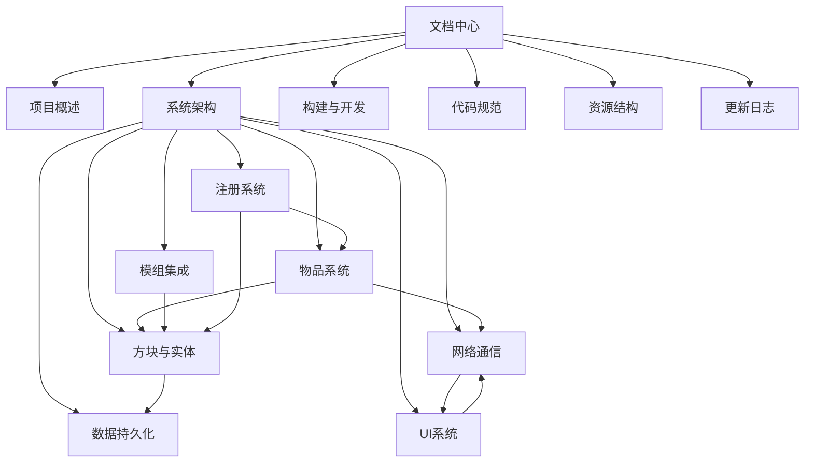

---
tags:
  - 索引
  - MOC
aliases:
  - 文档中心
  - 目录
---

# 📚 Resource Observer — 项目文档中心

> **模组名称：** Resource Observer  
> **模组 ID：** `resourceobserver`  
> **平台：** NeoForge 1.21.1 · Java 21  
> **许可证：** MIT  
> **当前版本：** 0.1.1

---

## 🗺️ 文档导航

### 核心文档

| 文档 | 简介 |
|------|------|
| [[01-项目概述]] | 项目背景、功能定位、核心玩法对象 |
| [[02-系统架构]] | 整体架构分层、包结构、数据流 |
| [[10-构建与开发]] | Gradle 构建、运行配置、依赖管理 |
| [[11-代码规范]] | 编码风格、命名约定、注释规范 |

### 服务端系统

| 文档 | 简介 |
|------|------|
| [[03-方块与实体]] | ObserverBlock + ObserverBlockEntity 详细设计 |
| [[04-物品系统]] | BindingTool 绑定流程、ResourceTerminal 终端 |
| [[08-数据持久化]] | SavedData、历史采样、玩家偏好存储 |
| [[09-注册系统]] | DeferredRegister 注册机制 |

### 客户端系统

| 文档 | 简介 |
|------|------|
| [[06-UI系统]] | 双 UI 架构、ViewModel、渲染器、图表 |
| [[05-网络通信]] | Payload 协议、编解码、通信流程 |

### 集成与资源

| 文档 | 简介 |
|------|------|
| [[07-模组集成]] | AE2 / Flux Networks / Mekanism / ModernUI 适配 |
| [[12-资源结构]] | 资产文件、数据包、模板、国际化 |

### 项目管理

| 文档 | 简介 |
|------|------|
| [[13-更新日志]] | 版本历史与变更记录 |

---

## 🔗 关系总览

---

## 📝 文档维护说明

本文档集设计为 **Obsidian 兼容格式**：

- 所有文档使用 `[[wikilink]]` 双向链接，在 Obsidian 图谱视图中可直接查看文档关系
- 每个文档包含 YAML frontmatter（tags、aliases）以支持 Obsidian 标签和搜索
- Mermaid 图表在 Obsidian 中原生渲染
- 建议在 Obsidian 设置中启用 **"使用 Wiki 链接"** 和 **"自动更新内部链接"**

**更新周期：** 每个开发阶段结束后由 AI 辅助更新文档，确保与代码同步。
