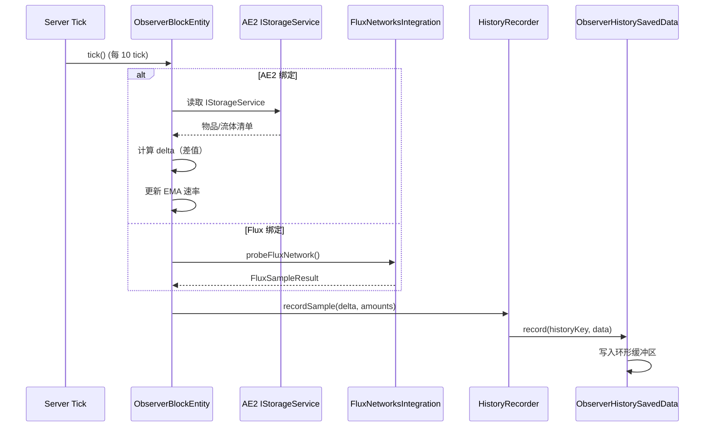
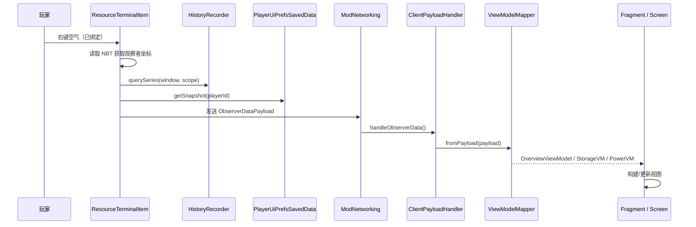
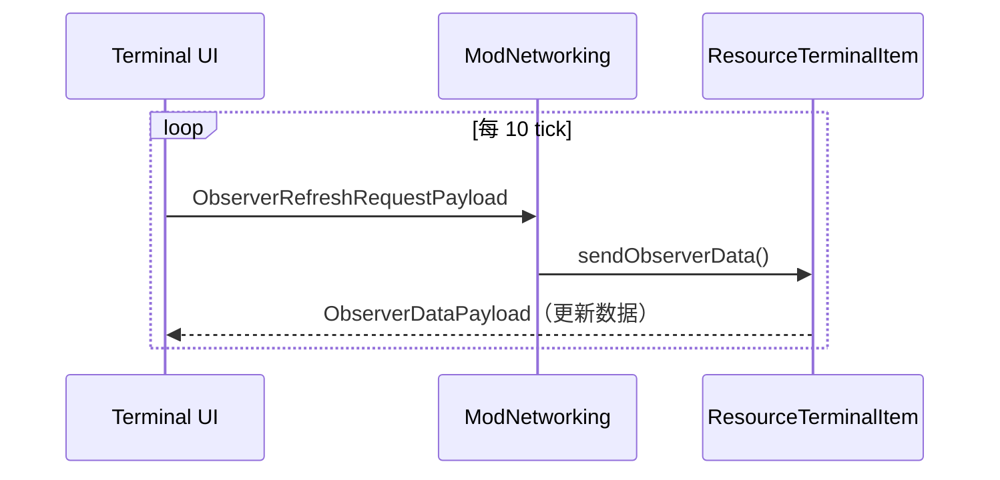
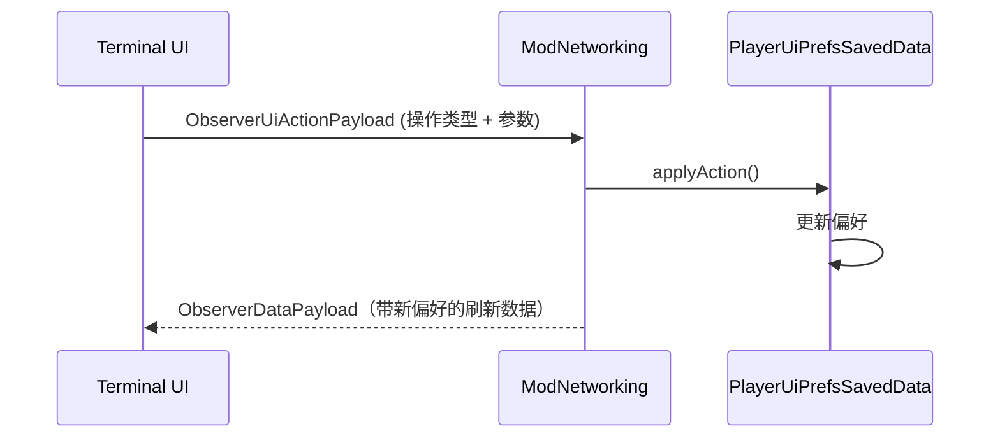

---
tags:
  - 架构
  - 设计
aliases:
  - 系统架构
  - 架构设计
---

# 系统架构

## 架构分层

项目采用**清晰的分层架构**，服务端与客户端代码严格分离：

```
com.yuyinrl.resourceobserver
├── ResourceObserverMod          ← 模组入口
├── registry/                    ← 注册层
├── service/                     ← Web ↔ BlockEntity 桥接层（v0.8.0）
│   ├── ObserverService          ← listObservers / findByPos
│   └── snapshot/                ← 服务端权威数据源（v1.0.0-beta.5）
│       ├── overview/            ← OverviewSnapshotBuilder + Localizer
│       ├── storage/             ← StorageSnapshotBuilder + KPI/Buffer 工具
│       ├── power/               ← PowerSnapshotBuilder + PowerKpiBuilder
│       └── crafting/            ← CraftingSnapshotBuilder
├── world/                       ← 服务端游戏逻辑
│   ├── block/                   ← 方块 & 方块实体
│   │   └── entity/
│   │       ├── ObserverBlockEntity   ← 主实体（1083 行，三委托架构）
│   │       ├── Ae2DataStore          ← 采样数据容器（18 个 Map）
│   │       ├── Ae2Sampler            ← AE2 采样器
│   │       └── Ae2CellProber         ← Cell 反射探测 + 容量评估
│   ├── item/                    ← 物品
│   ├── history/                 ← 历史数据存储
│   ├── command/                 ← 调试命令
│   └── ui/                      ← 玩家偏好持久化
├── network/                     ← 网络通信协议
├── integration/                 ← 模组适配器
├── ui/state/                    ← 共享 UI 状态枚举
└── client/                      ← 客户端专用代码
    ├── input/                   ← 按键绑定
    ├── screen/                  ← 原版 Screen 实现
    │   ├── ResourceTerminalScreenV2  ← V2 Screen（F8 快捷键，1s 自动刷新）
    │   ├── widget/              ← V2 widget kit（Tabs/TextField/ProgressBar/LineChart）
    │   └── v2/                  ← V2 Panel 组件树（overview/storage/power）
    │       └── LatestSnapshotProvider ← ModernUI ↔ V2 静态快照桥
    ├── modernui/                ← ModernUI Fragment 实现
    ├── ui/                      ← ViewModel + 渲染器
    │   ├── format/              ← FormatUtils 共享格式化工具
    │   └── render/              ← 专用渲染器
    └── web/                     ← IconRenderer 客户端图标渲染
```

### 数据源统一（v1.0.0-beta.5 起）

派生计算（KPI / 进度 / 状态色 / 格式化字符串）全部下沉到 `service/snapshot/`，
形成「单一真理源 + 双 transport」管线：

```
service/snapshot/*Builder.fromObserver(...)   ← 服务端权威数据源
        │
   ┌────┴────┐
   ▼         ▼
 Packet    HTTP API
 (Mapper)  (JsonWriter)
   │         │
   ▼         ▼
 ModernUI  React Dashboard
  / V2
```

- **游戏内通道**：Snapshot → `*ViewModelMapper`（薄壳）→ ViewModel →
  ModernUI Fragment / V2 Panel
- **Web 通道**：Snapshot → `JsonWriter` → REST API → React `liveAdapter` → 组件
- **客户端 Mapper 仅做**：① 翻译 key → 文字 ② 客户端筛选状态叠加 ③ VM 1:1 透传，
  **不允许**计算 / 聚合（`selectedExtIds` 是唯一例外，per-player 用户态）

## 模组入口

`ResourceObserverMod` 是主入口类，标注 `@Mod("resourceobserver")`：

```java
public ResourceObserverMod(IEventBus modEventBus, ModContainer modContainer) {
    // 注册所有 DeferredRegister
    ModBlocks.register(modEventBus);
    ModItems.register(modEventBus);
    ModBlockEntities.register(modEventBus);
    ModCreativeTabs.register(modEventBus);
    // 注册网络通信
    ModNetworking.register(modEventBus);
    // 注册命令
    ObserverCommands.register();
    // 客户端：着色器 + 按键绑定
    ChartRenderShaders.register(modEventBus);
    ClientKeyBindings.register(modEventBus);
}
```

详见 → [[09-注册系统]]

## 核心数据流

### 采样流程（服务端）



### 终端打开流程（跨端）



### 定时刷新循环



### UI 交互流程



## 关键设计决策

### 服务端权威模型

所有数据采集和状态管理在**服务端**完成。客户端仅负责展示从服务端接收的数据。这确保了多人游戏中的数据一致性。

### 适配器模式集成

模组集成采用适配器模式（详见 [[07-模组集成]]）：

- AE2：直接 API 调用（硬依赖）
- Flux Networks：运行时可用性检查 + 反射
- Mekanism：通过 Flux 集成间接访问

### 双 UI 并行实现

GUI 维护两套并行实现（详见 [[06-UI系统]]）：

1. **ModernUI Fragment**：主实现，使用 Android 风格的 View/Fragment 系统
2. **Vanilla Screen**：回退实现，使用 Minecraft 原生 GuiGraphics

两者共享相同的 ViewModel 和 Mapper 层。

### 环形缓冲区历史存储

历史数据使用环形缓冲区存储（详见 [[08-数据持久化]]），支持三个时间窗口聚合：

- 最近一分钟
- 最近一小时
- 最近一天

## 线程模型

| 线程 | 职责 |
|------|------|
| Server Tick | ObserverBlockEntity 采样、HistoryRecorder 写入 |
| Network Thread → Server Thread | 处理 C→S Payload（通过 `enqueueWork`） |
| Network Thread → Render Thread | 处理 S→C Payload（通过 `enqueueWork`） |
| Render Thread | UI 渲染、ViewModel 映射 |

> ⚠️ 所有 Payload 处理器必须使用 `context.enqueueWork()` 确保在正确线程执行。
