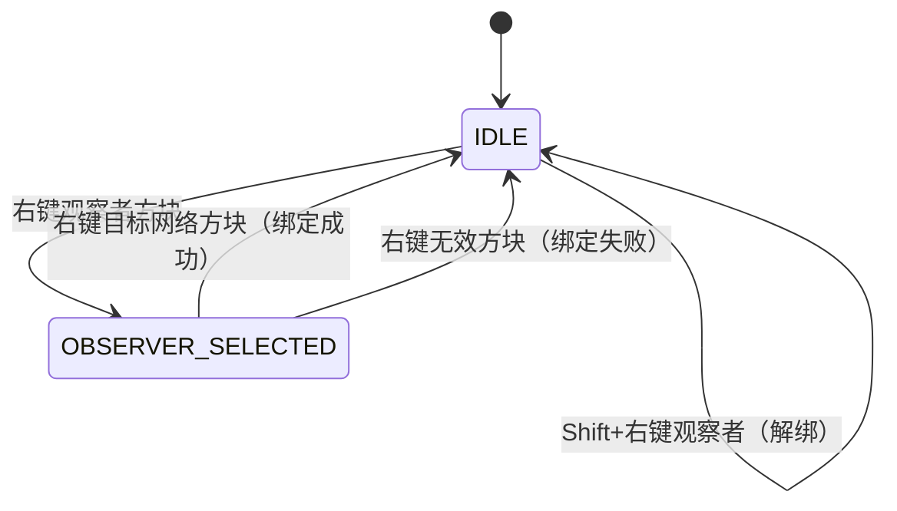
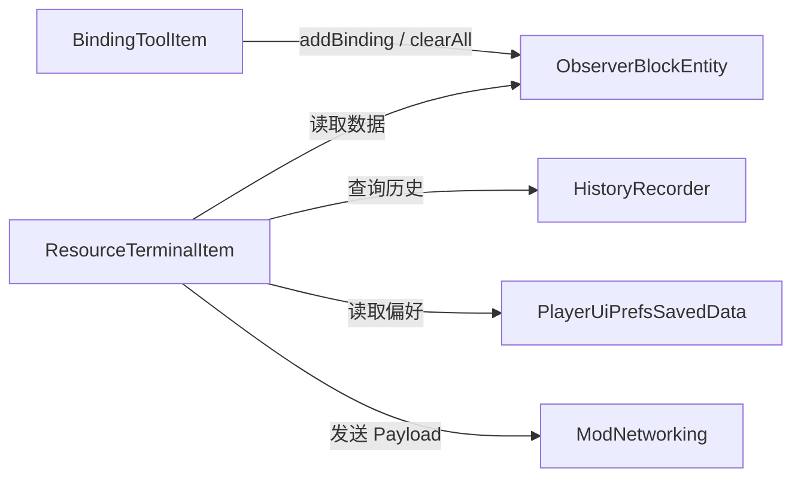

---
tags:
  - 服务端
  - 物品
aliases:
  - 物品系统
  - BindingTool
  - ResourceTerminal
---

# 物品系统

## BindingToolItem

**类路径：** `world.item.BindingToolItem`  
**继承：** `Item`  
**注册：** [[09-注册系统]] → `ModItems.BINDING_TOOL`

### 绑定状态机

绑定工具实现一个**两步状态机**，状态存储在玩家的 `PersistentData` 中：



### NBT 标签键

| 常量 | 值 | 存储位置 |
|------|-----|---------|
| `PLAYER_BIND_KEY` | `"resourceobserver_binding"` | 玩家 PersistentData |
| `TAG_SELECTED` | `"has_selected_observer"` | 上述 CompoundTag 内 |
| `TAG_X / TAG_Y / TAG_Z` | `"observer_x/y/z"` | 观察者方块坐标 |
| `TAG_DIMENSION` | `"observer_dimension"` | 观察者所在维度 |

### 交互流程详解

`useOn(UseOnContext)` 方法逻辑：

```
右键方块被调用
  ├── Shift+右键 + 目标是 ObserverBlock?
  │   └── 是 → clearAllBindings() → 聊天提示 "解绑成功" → 返回
  ├── 目标是 ObserverBlock?
  │   └── 是 → 存储坐标/维度到玩家 NBT → 聊天提示 "已选择观察者" → 返回
  ├── 已选择观察者？（检查玩家 NBT）
  │   ├── 否 → 聊天提示 "请先选择观察者" → 返回
  │   └── 是 → 继续绑定流程 ↓
  ├── 验证观察者方块仍存在
  ├── 解析网络类型（根据目标方块命名空间）
  │   ├── AE2 命名空间 → networkType = "AE2_ITEMS"
  │   ├── Flux 命名空间 + 路径含 "controller" → networkType = "FLUX_ENERGY"
  │   └── 其他 → 聊天提示 "不支持的网络类型" → 返回
  ├── 生成 networkId = "targetBlockId@posLong"
  ├── 调用 observerBlockEntity.addBinding(type, id, blockId)
  ├── 重置玩家 NBT 选择状态
  └── 聊天提示 "绑定成功"
```

### 网络类型识别规则

| 目标方块命名空间 | 额外条件 | 网络类型 |
|----------------|---------|---------|
| `ae2` / `appliedenergistics2` | 无 | `AE2_ITEMS` |
| `fluxnetworks` | 方块路径包含 `"controller"` | `FLUX_ENERGY` |
| 其他 | — | 不支持 |

---

## ResourceTerminalItem

**类路径：** `world.item.ResourceTerminalItem`  
**继承：** `Item`  
**注册：** [[09-注册系统]] → `ModItems.RESOURCE_TERMINAL`

### NBT 标签键

| 常量 | 值 | 存储位置 |
|------|-----|---------|
| `TAG_BOUND` | `"bound_observer"` | 物品 NBT |
| `TAG_X / TAG_Y / TAG_Z` | `"observer_x/y/z"` | 上述 CompoundTag 内 |
| `TAG_DIMENSION` | `"observer_dimension"` | 观察者所在维度 |
| `TAG_HAS_NETWORK` | `"has_network"` | 观察者是否有网络绑定 |
| `TAG_INITIALIZED` | `"initialized"` | 物品是否已进入玩家背包（用于贴图切换） |
| `TAG_BINDINGS` | `"bindings"` | 观察者绑定列表（ListTag） |

### 物品贴图状态切换

通过 `ModItemProperties` 注册客户端物品属性 `resourceobserver:bound`：
- 返回 `0.0f`（正常贴图）：无 NBT（创造模式/合成预览）或已绑定且有网络
- 返回 `1.0f`（异常贴图）：已初始化但未绑定或绑定的观察者无网络

`inventoryTick()` 在物品进入玩家背包时标记 `TAG_INITIALIZED`，使创造模式物品栏中显示正常贴图，取出后自动刷新为异常贴图。

### Tooltip 信息展示

`appendHoverText()` 实现分层 Tooltip：
- **常规状态**：显示观察者坐标和绑定数量，附 "按住 [Shift] 查看详情" 提示
- **按住 Shift**：展开显示各绑定的网络类型、目标坐标、方块类型（暗色调）

### 交互行为

| 操作 | 方法 | 行为 |
|------|------|------|
| 右键观察者方块 | `useOn()` | 将终端绑定到该观察者，同步网络状态到 NBT |
| 空手右键（已绑定 + 有网络） | `use()` | 打开仪表盘 GUI |
| 空手右键（已绑定 + 无网络） | `use()` | 聊天提示 "观察者未连接到任何网络" |
| 空手右键（未绑定） | `use()` | 聊天提示 "终端未绑定" |

### 数据发送流程

当玩家打开终端时，`sendObserverData()` 执行以下步骤：

1. 从物品 NBT 读取观察者坐标
2. 获取对应的 `ObserverBlockEntity`
3. 查询 `HistoryRecorder` 获取图表时间序列
4. 读取 `PlayerUiPrefsSavedData` 获取玩家偏好
5. 构建 `ObserverDataPayload` 记录
6. 通过 `PacketDistributor` 发送给客户端

详见 → [[05-网络通信]] 和 [[08-数据持久化]]

---

## DebugTerminalItem

**类路径：** `world.item.DebugTerminalItem`  
**继承：** `Item`  
**注册：** [[09-注册系统]] → `ModItems.DEBUG_TERMINAL`

调试用终端物品，行为与 `ResourceTerminalItem` 类似，但默认启用调试面板。

---

## 物品系统与其他模块的关系



参见：
- [[03-方块与实体]] — ObserverBlockEntity 详细设计
- [[05-网络通信]] — ObserverDataPayload 结构
- [[08-数据持久化]] — 历史记录和玩家偏好
