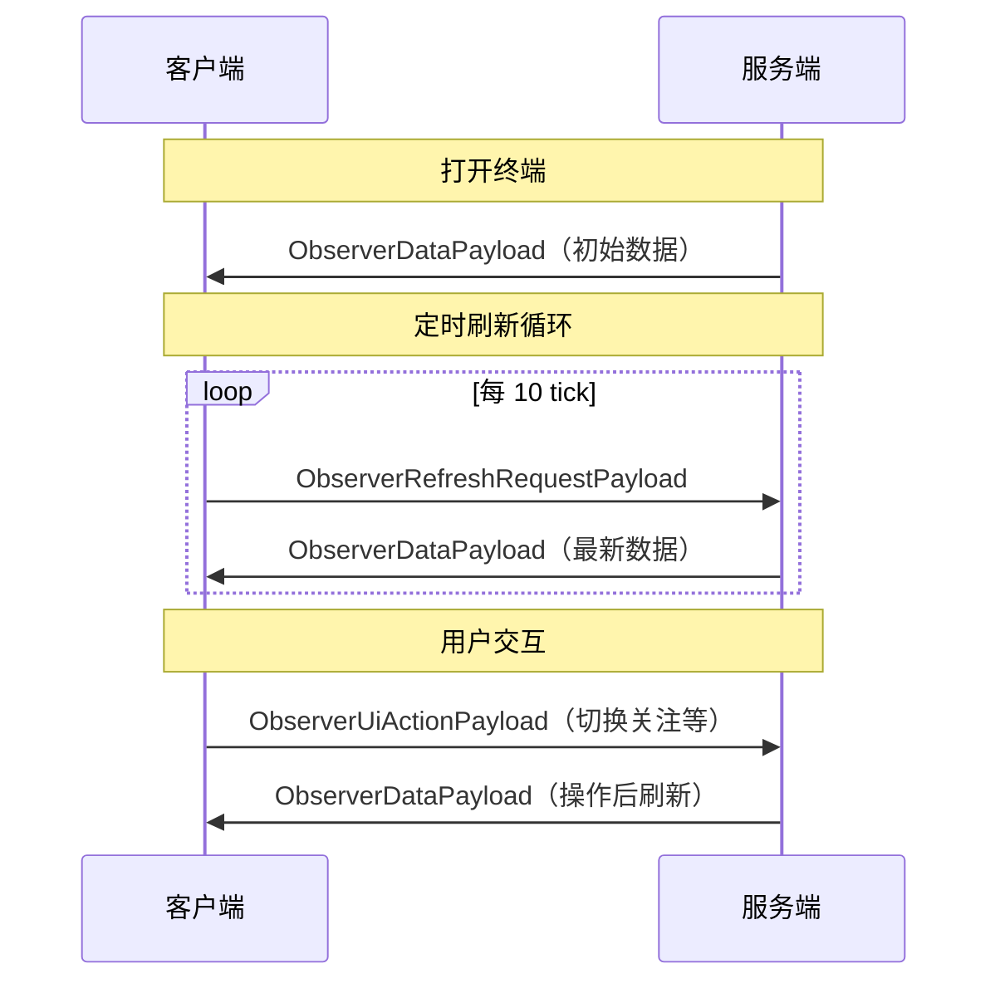

---
tags:
  - 网络
  - 协议
aliases:
  - 网络通信
  - Payload
  - ModNetworking
---

# 网络通信

## 概述

模组使用 NeoForge 的自定义 Payload 系统实现服务端与客户端通信。所有 Payload 均为 Java `record` 类型，使用 `StreamCodec` 进行二进制序列化。

**协议版本：** `"8"`

### 注册入口

**类路径：** `network.ModNetworking`

通过 `RegisterPayloadHandlersEvent` 注册，在 [[02-系统架构]] 的模组入口中调用。

---

## Payload 一览

| Payload | 方向 | 触发条件 |
|---------|------|---------|
| `ObserverDataPayload` | S→C | 终端打开 / 定时刷新 / UI 操作响应 |
| `ObserverRefreshRequestPayload` | C→S | 终端 GUI 每 10 tick 自动发送 |
| `ObserverUiActionPayload` | C→S | 玩家在 GUI 中执行交互操作 |
| `CraftingPlanRequestPayload` | C→S | 请求 AE2 合成计划摘要（plan） |
| `CraftingPlanResultPayload` | S→C | 返回合成计划摘要 / 缺料 / CPU 列表 / 合成树 |
| `CraftingOrderConfirmPayload` | C→S | 确认提交已缓存的 AE2 计划 |
| `CraftingTreeRequestPayload` | C→S | 按 `treeId` 请求完整合成树 |
| `CraftingTreeResponsePayload` | S→C | 返回 `CraftingTreeNode` 根节点 |
| `ClientNameUploadPayload` | C→S | 客户端上传本地语言下的名称镜像 |
| `ClientIconUploadPayload` | C→S | 客户端上传真实渲染后的 PNG 图标 |
| `IconRequestPayload` | S→C | 专用服务端请求在线客户端代渲染图标 |

---

## ObserverDataPayload（S→C）

**类路径：** `network.ObserverDataPayload`

这是最核心的数据包，携带观察者的完整监控数据。

### 顶层字段

```java
public record ObserverDataPayload(
    BlockPos observerPos,           // 观察者坐标
    boolean isBound,                // 是否已绑定
    boolean debugPreferred,         // 调试模式偏好
    ChartWindow chartWindow,        // 当前图表窗口
    ChartScope chartScope,          // 图表范围（全局/单物品）
    String chartScopeItemId,        // 聚焦物品 ID（若 scope=ITEM）
    List<ChartPoint> chartSeries,   // 物品流量图表数据
    List<ChartPoint> energyChartSeries, // 能量图表数据
    String tableGroupFilterKey,     // 当前分组筛选
    TableSortMode tableSortMode,    // 排序模式
    boolean tableSortDesc,          // 是否降序
    TableStatusFilter tableStatusFilter, // 状态筛选器
    int watchlistLimit,             // 关注列表上限
    List<String> watchlistItemIds,  // 关注的物品 ID
    List<GroupEntry> groups,        // 物品分组定义
    List<BindingEntry> bindings,    // 所有绑定的详细数据
    List<CraftingBindingData> craftingBindings // 0.4.0+：AE2 合成快照
)
```

**`craftingBindings`（0.4.0+）** 对每个 `AE2_ITEMS` 绑定提供：

- `CraftableSnapshot(itemId, displayName)` —— 可合成资源；`itemId` 支持普通物品 ID 与 `fluid:<namespace>:<path>` 流体键
- `CraftingJobSnapshot(cpuName, busy, outputItemId, remainingAmount, coProcessors, storageBytes, progressFraction, treeId)` —— 活跃 CPU 任务
- `CraftingStorageSnapshot(cpuCount, busyCpuCount, totalStorageBytes, totalCoProcessors, reliable)` —— 合成存储汇总

服务端在构建 `craftables` 时会先使用 `AEKey.dropSecondary()` 归一化，再按 `getCraftingFor(key)` / `canEmitFor(key)` 过滤，确保列表和实际下单能力一致。

空列表表示该绑定无合成数据（AE2 不可用或反射失败），向后兼容旧客户端。

### 嵌套记录类型

#### ChartPoint

```java
public record ChartPoint(
    int slotIndex,         // 时间槽索引
    long production,       // 产量
    long consumption,      // 消耗量
    long net,              // 净变化
    long stock,            // 库存量
    boolean hasFlow,       // 是否有流量数据
    boolean hasStock       // 是否有库存数据
)
```

#### BindingEntry

```java
public record BindingEntry(
    String networkType,             // "AE2_ITEMS" | "FLUX_ENERGY"
    String networkId,               // 网络标识
    String targetBlockId,           // 目标方块注册名
    List<ItemDeltaEntry> itemDeltas, // 物品变化列表
    // KPI 统计字段...
    long totalProduction,
    long totalConsumption,
    long netChange,
    CellCapacityMetrics capacityMetrics
)
```

#### ItemDeltaEntry

```java
public record ItemDeltaEntry(
    String itemId,           // 物品注册名
    String displayName,      // 显示名称
    long productionRate,     // 产量速率（/min）
    long consumptionRate,    // 消耗速率（/min）
    long amount,             // 当前库存
    String groupKey,         // 所属分组
    String iconSprite        // 图标精灵 ID
)
```

#### CellCapacityMetrics

```java
public record CellCapacityMetrics(
    long itemBytesUsed, long itemBytesTotal,
    long itemTypesUsed, long itemTypesTotal,
    long fluidBytesUsed, long fluidBytesTotal,
    long fluidTypesUsed, long fluidTypesTotal,
    long externalItemTypes, long externalFluidTypes,
    long externalItemUnits, long externalFluidUnits
)
```

#### EntryType 枚举

| 值 | ID | 说明 |
|----|----|------|
| `ITEM` | 0 | 物品通道 |
| `FLUID` | 1 | 流体通道 |

---

## ObserverRefreshRequestPayload（C→S）

**类路径：** `network.ObserverRefreshRequestPayload`

```java
public record ObserverRefreshRequestPayload(
    BlockPos observerPos     // 要刷新的观察者坐标
)
```

客户端终端 GUI 每 **10 tick** 自动发送此请求。服务端收到后调用 `ResourceTerminalItem.sendObserverData()` 重新构建并返回最新的 `ObserverDataPayload`。

---

## ObserverUiActionPayload（C→S）

**类路径：** `network.ObserverUiActionPayload`

```java
public record ObserverUiActionPayload(
    BlockPos observerPos,       // 观察者坐标
    UiActionType actionType,    // 操作类型
    String itemId,              // 单物品 ID（可空）
    List<String> itemIds,       // 物品 ID 列表（可空）
    String actionValue,         // 操作值（可空）
    ChartWindow chartWindow,    // 图表窗口
    ChartScope chartScope,      // 图表范围
    String scopeItemId          // 范围物品 ID
)
```

### UiActionType 枚举

| 值 | ID | 说明 |
|----|----|------|
| `TOGGLE_WATCH` | 0 | 切换物品的关注状态 |
| `SET_GROUP_FILTER_KEY` | 1 | 设置分组筛选 |
| `SET_SORT_MODE` | 2 | 更改排序列 |
| `SET_STATUS_FILTER` | 3 | 设置状态筛选（产出/消耗/平衡） |
| `RESET_FILTERS` | 4 | 重置所有筛选为默认值 |
| `ASSIGN_ITEM_GROUP` | 5 | 将物品分配到分组 |
| `CREATE_GROUP` | 6 | 创建自定义分组 |
| `RENAME_GROUP` | 7 | 重命名分组 |
| `DELETE_GROUP` | 8 | 删除自定义分组 |
| `CLEAR_ITEM_GROUP` | 9 | 移除物品的分组 |

服务端收到后调用 `PlayerUiPrefsSavedData.applyAction()` 应用操作，然后自动返回刷新的 `ObserverDataPayload`。

---

## 合成下单相关 Payload（0.7.0+）

### `CraftingPlanRequestPayload`（C→S）

客户端提交 `observerPos + networkId + itemId + amount`，服务端异步启动 AE2 `beginCraftingCalculation`，构建计划摘要并缓存 `planId`。

### `CraftingPlanResultPayload`（S→C）

返回字段包含：

- `status / message / planId / simulation / bytes`
- `finalOutputItemId / finalOutputDisplayName / finalOutputAmount`
- `usedItems / missingItems / emittedItems / patternTimes`
- `cpus`
- `treeId / treeRoot`

其中各类堆栈条目的 `itemId` 同样支持 `fluid:` 前缀流体键。

### `CraftingOrderConfirmPayload`（C→S）

客户端用 `planId`（可选附带 CPU 名称）确认提交，服务端调用 `CraftingOrderService.confirmOrder(...)`。

### `CraftingTreeRequestPayload` / `CraftingTreeResponsePayload`

用于按 `treeId` 拉取完整 `CraftingTreeNode`，支持 Review 阶段和运行中任务详情共用。

---

## 客户端资源镜像 Payload（0.7.0+）

### `ClientNameUploadPayload`（C→S）

客户端登录后分批上传 `itemId -> displayName` 名称镜像，服务端写入 `ItemNameResolver.OVERRIDE`，弥补专用服务端缺失玩家语言资源的问题。

### `ClientIconUploadPayload`（C→S）

客户端把真实渲染得到的 PNG 图标回传服务端缓存，供 Web `/api/icon/...` 直接命中。

### `IconRequestPayload`（S→C）

专用服务端在图标缓存未命中时广播请求，在线客户端异步渲染后通过 `ClientIconUploadPayload` 回传。

---

## 辅助枚举

### ChartWindow

| 值 | 说明 |
|----|------|
| `MINUTE` | 最近一分钟 |
| `HOUR` | 最近一小时 |
| `DAY` | 最近一天 |

### ChartScope

| 值 | 说明 |
|----|------|
| `GLOBAL` | 全局聚合 |
| `ITEM` | 聚焦单个物品 |

### 编解码工具

**`PayloadCodecUtils`** 提供 StreamCodec 工具方法，用于序列化 Optional、List、Enum 等类型。

**`EnumLookup`** 提供 Enum 名称/ID 双向查找的工具类。

---

## 通信时序总览



参见：
- [[04-物品系统]] — ResourceTerminalItem 触发 Payload 发送
- [[06-UI系统]] — 客户端接收和渲染 Payload 数据
- [[08-数据持久化]] — PlayerUiPrefsSavedData 处理 UI 操作
