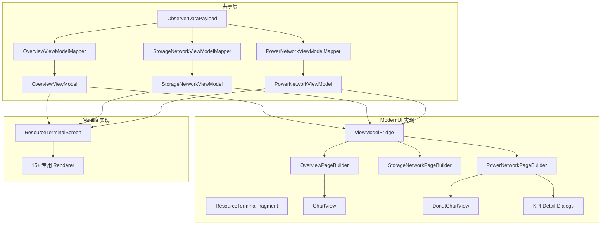

---
tags:
  - 客户端
  - UI
  - 渲染
aliases:
  - UI系统
  - 用户界面
  - ModernUI
---

# UI 系统

## 概述

模组采用**双 UI 并行架构**：

1. **ModernUI Fragment**（主实现）— 使用 icyllis ModernUI 的 Android 风格 View/Fragment 系统
2. **Vanilla Screen**（回退）— 使用 Minecraft 原生 `Screen` + `GuiGraphics` API

两套实现共享相同的 **ViewModel** 和 **ViewModelMapper** 层，确保数据一致。



---

## 标签页结构

| 标签页 | 枚举值 | 内容 |
|--------|--------|------|
| 总览 | `TerminalPage.OVERVIEW` | 综合 KPI、流量图表、关注列表、物品表格 |
| 存储网络 | `TerminalPage.STORAGE` | 存储节点、容量 KPI、物品清单、用量甜甜圈图 |
| 能量网络 | `TerminalPage.POWER` | 设备列表、负载分布、过载告警、能量图表 |

---

## ViewModel 层

### OverviewViewModel

**类路径：** `client.ui.OverviewViewModel`

| 字段 | 类型 | 说明 |
|------|------|------|
| `headerTitle` | `String` | 标题文本 |
| `headerSubtitle` | `String` | 副标题 |
| `linkStatus` | `String` | 连接状态描述 |
| `kpis` | `List<KpiMetric>` | 4 张 KPI 卡片（产量/消耗/存储/平衡） |
| `chartWindow` | `ChartWindow` | 当前时间窗口 |
| `chartSeries` | `List<FlowPoint>` | 物品流量图表序列 |
| `energyChartSeries` | `List<FlowPoint>` | 能量图表序列 |
| `watchlistItems` | `List<WatchlistItem>` | 关注列表物品 |
| `tableGroups` | `List<TableGroup>` | 分组后的物品表格 |
| `kpiDetails` | `List<KpiDetail>` | KPI 钻取详情 |
| `storageDetail` | `StorageDetail` | 存储容量详情 |

**状态枚举：** `NORMAL` / `WARNING` / `CRITICAL`

### StorageNetworkViewModel

**类路径：** `client.ui.StorageNetworkViewModel`

| 字段 | 类型 | 说明 |
|------|------|------|
| `nodes` | `List<NodeEntry>` | 存储节点列表 |
| `selectedNodeId` | `String` | 当前选中节点 |
| `alertFilterActive` | `boolean` | 仅显示告警物品 |
| `kpiCards` | `List<StorageKpi>` | 存储 KPI 卡片 |
| `items` | `List<ItemRow>` | 物品清单 |
| `usageSegments` | `List<UsageSegment>` | 用量分布 |

**告警级别：** `GREEN` / `YELLOW` / `RED`
- 绿色：库存充足
- 黄色：库存仅可维持 <30 秒消耗
- 红色：危急或存储 ≥95% 满

### PowerNetworkViewModel

**类路径：** `client.ui.PowerNetworkViewModel`

| 字段 | 类型 | 说明 |
|------|------|------|
| `devices` | `List<DeviceEntry>` | 能量设备列表 |
| `kpiCards` | `List<PowerKpi>` | 能量 KPI（有效输入/输出/储能/外储排除） |
| `loadSegments` | `List<LoadSegment>` | 负载分布 |
| `overloadAlerts` | `List<OverloadAlert>` | 过载告警 |
| `totalInputPerTick` / `totalOutputPerTick` | `long` | 总输入/输出 FE/t |
| `totalStored` / `totalCapacity` | `long` | 总存储/容量 |
| `debugSnapshot` | `DebugSnapshot` | 调试快照（设备明细） |
| `consumers` | `List<ConsumerEntry>` | 消费者列表（按设备类型聚合） |

**DebugSnapshot：** 包含 `inputDevices`、`outputDevices`、`externalGroups`、各类设备计数（plugCount/pointCount/storageCount/controllerCount）

**ConsumerEntry：** 按设备类型聚合的用电器信息，包含 `deviceName`、`modName`（所属模组）、`consumptionPerTick`、`percentage`（负载占比）、`supplyRatio`（供能占用）、`color`、`count`

**ExternalGroup：** 外部容器分组，包含 `extId`、`displayName`、`stored`、`capacity`、`interfaceKeys`（关联的 Flux 接口 key 列表）

---

## ViewModelMapper 层

三个 Mapper 类将 `ObserverDataPayload` 转换为对应的 ViewModel：

| Mapper | 输入 | 输出 |
|--------|------|------|
| `OverviewViewModelMapper` | `ObserverDataPayload` | `OverviewViewModel` |
| `StorageNetworkViewModelMapper` | `ObserverDataPayload` | `StorageNetworkViewModel` |
| `PowerNetworkViewModelMapper` | `ObserverDataPayload` | `PowerNetworkViewModel` |

**OverviewViewModelMapper 转换步骤：**

1. 聚合所有绑定的 KPI 总量（跳过 FLUX_ENERGY 的物品指标）
2. 构建每物品的表格行（产量/消耗/净值/库存）
3. 计算存储容量展示
4. 转换图表数据点
5. 构建分组列表
6. 应用状态/分组筛选
7. 应用排序模式
8. 构建 `TableGroup` 层次
9. 构建关注列表

**PowerNetworkViewModelMapper 关键流程：**

1. `parseDebugDeviceItem`：解析 Flux 的 `ItemDeltaEntry` 为设备指标（stored/cap/maxAccept），仅从 `.stored` 项提取显示名以避免后缀污染
2. `buildConsumers`：两阶段去重聚合（Pass 1: `extId` 合并同一物理设备 → Pass 2: `stripCoordinates` 按类型分组）
3. `extractModFromRefName`：从设备注册名提取模组命名空间
4. `stripCoordinates`：去除显示名中的坐标后缀

---

## ModernUI 实现

### ResourceTerminalFragment

**类路径：** `client.modernui.ResourceTerminalFragment`  
**继承：** `Fragment`（ModernUI）

核心 Fragment，管理标签页切换和数据刷新：

- **刷新间隔：** 10 tick
- **标签页切换：** 通过 chrome bar 按钮
- **顶栏按钮：** 仅保留尺寸调节按钮（S/M/L），圆形样式 + 描边 + 悬停缩放 + 波纹反馈，关闭按钮已移除
- **数据桥接：** 持有 `ViewModelBridge` 实例

### ViewModelBridge

**类路径：** `client.modernui.ViewModelBridge`

ViewModel 和 UI 之间的数据桥梁：

| 方法 | 说明 |
|------|------|
| `applyPayload(ObserverDataPayload)` | 更新所有 ViewModel，变更时通知监听器 |
| `updateStorageFilter(nodeId, alert)` | 更新存储页面本地过滤状态 |
| `toggleExternalGroupSelection(ids)` | 切换能量页面外部分组选择 |

### PageBuilder 类

每个标签页有对应的 PageBuilder，负责构建 ModernUI 视图树：

#### OverviewPageBuilder

**区段布局（垂直排列）：**

| 区段 | 高度占比 | 约束 |
|------|---------|------|
| Header | 12% | min 44dp, max 90dp |
| KPI Grid | 18% | min 64dp, max 130dp |
| Chart | 32% | min 100dp, max 240dp |
| Watchlist | 18% | min 64dp, max 130dp |
| Table | 剩余 | 分页 |

**增量更新：** 计算 ViewModel 的"结构指纹"，若未变化则仅更新文本，不重建视图树。保留滚动位置、图表选择、分组折叠状态。

#### StorageNetworkPageBuilder

区段：KPI 卡片 → 节点列表 → 用量摘要 → 告警筛选 → 物品表格

#### PowerNetworkPageBuilder

区段：KPI 卡片（可点击） → 双列布局（左 33%: 容量甜甜圈图 + 过载告警 + 外储控制台 | 右 67%: 电网负载图 + 设备列表）

**KPI 卡片点击弹窗系统：**

每张 KPI 卡片点击后打开对应详情弹窗（`showKpiDetailDialog`），弹窗支持实时数据刷新：

| KPI 索引 | 标题 | 弹窗内容 |
|---------|------|---------|
| 0 | 有效输入 | 总/有效/排除输入概览 → 输入设备列表（速率+占比）；排除的设备标注 `[已排除]` 标签 |
| 1 | 有效输出 | 总/有效/排除输出概览 → 用电器明细（颜色圆点+设备名+模组+速率+占比） |
| 2 | 储能 | 内部储能（进度条）+ 外部容器逐个展示（进度条）+ 合计；无储能方块时显示 info 提示 |
| 3 | 外储排除 | 排除的输入/输出/合计速率 → 排除分组列表（↓输入/↑输出+储能百分比） |

**弹窗通用特性：**

- 半透明遮罩 + 卡片入场/退场动画（缩放+淡入淡出）
- 标题栏 + ✕ 关闭按钮 + 可滚动内容区 + 滚动渐变遮罩
- 通过 `setDialogContentRefresher` 注册实时刷新回调
- 点击遮罩或关闭按钮均可关闭

**设备去重机制（两阶段聚合）：**

用电器列表采用两阶段去重，确保同一物理设备不重复统计：

| 阶段 | Key | 目的 |
|------|-----|------|
| Pass 1 | `ref.extId()`（基于位置的唯一 ID） | 合并同一物理设备的多个接口连接 |
| Pass 2 | `stripCoordinates(displayName)` | 按设备类型名分组显示 |

`extId` 格式：`"pos_{dimHash}_x_y_z"`（普通方块）或 `"mekmb_{uuid}"`（Mekanism 多方块）

**进度条实现（weight 布局）：**

储能进度条使用 `LinearLayout` + `weightSum(1.0)` 按权重分配填充/空白区域，避免 `post()` 延迟导致的刷新闪烁。

### 自定义 View

#### ChartView

**类路径：** `client.modernui.ChartView`  
**继承：** `View`（ModernUI）

折线图组件，用于渲染产量/消耗/净值/库存趋势：

- **网格背景：** 半透明网格线
- **零轴线：** 当范围跨越零时显示
- **多系列渲染：** 彩色折线
- **悬停交互：** 垂直参考线 + 数据点 + 多行 tooltip

**数据预处理：** 通过 `ChartMath.prepareChart()` 进行 Hermite 样条插值和 EMA 平滑。

#### DonutChartView

**类路径：** `client.modernui.DonutChartView`  
**继承：** `View`（ModernUI）

容量余量甜甜圈图，用于能量网络中以发电量为 100% 展示各负载段占比与余量：

- **外环：** 总发电容量（100%）
- **分段：** 消费者类别占比（带颜色圆点）
- **余量环：** 剩余容量
- **中心文本：** 余量百分比

**常量：** `INNER_RATIO = 0.62f` · `SEG_GAP_DEG = 1.2f` · `HOVER_EXPAND = 3f`

> **注：** 早期版本中存在 `MiniDonutView` 用于负载占比微型甜甜圈，已废弃并由上下文条（Context Bar）替代。

---

## Vanilla Screen 实现

### ResourceTerminalScreen

**类路径：** `client.screen.ResourceTerminalScreen`  
**继承：** `Screen`（Minecraft）

原版 GUI 回退实现，当 ModernUI 不可用时使用。

> **注意：** 自 v0.2.1 起，Vanilla Screen 进入冻结状态，后续 UI 功能变更仅在 ModernUI Fragment 实现中进行。

**布局系统：**
- 根面板居中
- 响应式尺寸模式：S(0.95x) / M(1.0x) / L(1.05x)
- 区段：Header → KPI Grid → Chart → Watchlist → Table

**事件处理：**

| 交互 | 行为 |
|------|------|
| KPI 卡片点击 | 钻取详情视图 |
| 图表悬停 | tooltip 显示 |
| 关注列表项点击 | 图表聚焦到单物品 |
| 表格行点击 | 选择物品 |
| 分组标题点击 | 展开/折叠 |

**弹出菜单：** 分组筛选下拉、排序选择器、状态筛选切换、右键分组管理

---

## 渲染器

`client.ui.render` 包下包含 15+ 专用渲染器：

| 渲染器 | 职责 |
|--------|------|
| `HeaderRenderer` | 标题栏区段 |
| `KpiRenderer` | 通用 KPI 卡片 |
| `ChartRenderer` | 图表渲染枚举/逻辑 |
| `ChartMath` | Hermite 插值、EMA 平滑、悬停检测 |
| `TableRenderer` | 通用表格渲染 |
| `WatchlistRenderer` | 关注列表区段 |
| `StorageKpiRenderer` | 存储专用 KPI |
| `StorageNodeListRenderer` | 存储节点表 |
| `StorageItemListRenderer` | 物品清单表 |
| `StorageUsageSummaryRenderer` | 存储甜甜圈图 |
| `PowerKpiRenderer` | 能量专用 KPI |
| `PowerDeviceListRenderer` | 能量设备表 |
| `PowerLoadChartRenderer` | 负载分布图 |
| `PowerGridChartRenderer` | 电网可视化 |
| `PowerOverloadAlertRenderer` | 过载告警 |
| `PowerDebugPanelRenderer` | 调试面板 |
| `RenderUtils` | 渲染工具方法 |

---

## 主题系统

### UiThemeTokens

**类路径：** `client.ui.UiThemeTokens`

全局颜色常量（ARGB）：

| 类别 | 色值 | 用途 |
|------|------|------|
| `PANEL_BG` | `0xE00A1020` | 面板背景（深蓝半透） |
| `SECTION_BG` | `0xCC101A30` | 区段背景 |
| `CYAN` | `0xFF22D3EE` | 产量/活跃状态 |
| `AMBER` | `0xFFF59E0B` | 消耗/警告 |
| `EMERALD` | `0xFF34D399` | 健康/正向 |
| `ROSE` | `0xFFFB7185` | 告警/负向 |
| `BLUE` | `0xFF60A5FA` | 信息/链接 |

### ModernUiTheme

**类路径：** `client.modernui.ModernUiTheme`

ModernUI 专用主题工厂：

| 参数 | 值 | 说明 |
|------|-----|------|
| `textScale` | 1.2f | 所有文本缩放 |
| `layoutScale` | 1.2f | 图标/间距/行高缩放 |

**工厂方法：** `cardBackground()` · `sectionBackground()` · `panelBackground()` · `tabBackground()` · `statefulBackground()`

---

## ChartMath 算法

**类路径：** `client.ui.render.ChartMath`

纯 CPU 运算，无副作用。

### 单调 Hermite 样条插值

使用 Fritsch-Carlson 方法确保单调性：
- 计算基础点斜率
- 若 α² + β² > 9，缩放切向量
- 在每对基础点之间生成三次 Hermite 曲线

### EMA 平滑

- α = 0.45（45% 当前值 + 55% 前值）
- 在连续有效数据段内应用

### 核心入口

```java
PreparedChart prepareChart(
    plotWidth, height,           // 绘图区尺寸
    series, page,                // 数据系列和页面类型
    lineMode, smoothingMode,     // 渲染模式
    curveSubdiv, sampleScale     // 曲线细分和缩放
)
```

参见：
- [[05-网络通信]] — ObserverDataPayload 数据来源
- [[07-模组集成]] — ModernUI 框架集成
- [[12-资源结构]] — GUI 纹理和精灵资源
