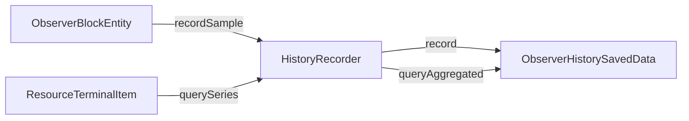
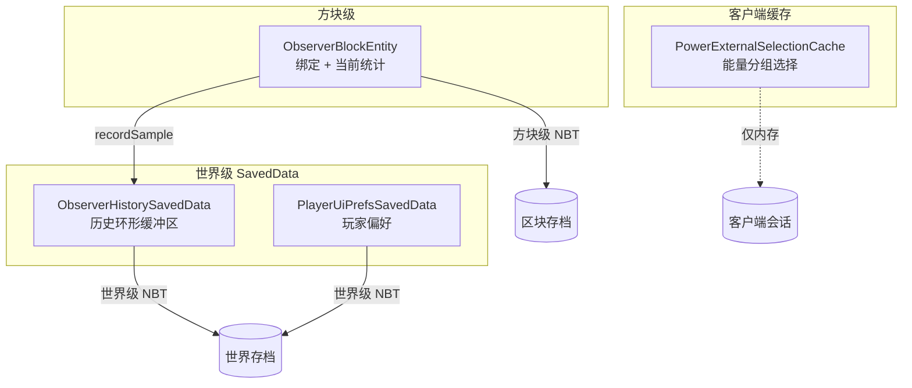

---
tags:
  - 服务端
  - 持久化
  - 数据
aliases:
  - 数据持久化
  - SavedData
  - 历史记录
---

# 数据持久化

## 概述

模组使用三层持久化机制：

| 层级 | 存储类 | 生命周期 | 内容 |
|------|--------|---------|------|
| 方块实体 NBT | `ObserverBlockEntity` | 随区块加载/卸载 | 绑定信息、当前统计 |
| 世界级 SavedData | `ObserverHistorySavedData` | 随世界存档 | 历史采样环形缓冲区 |
| 世界级 SavedData | `PlayerUiPrefsSavedData` | 随世界存档 | 玩家 UI 偏好 |

---

## ObserverBlockEntity NBT

方块实体数据随区块保存，包含：

- `List<BoundEntry>` — 所有网络绑定（networkType + networkId + targetBlockId）
- 当前采样统计（statsMap）
- 物品库存快照
- 采样计数器状态

通过 `saveAdditional()` 和 `loadAdditional()` 序列化。

详见 → [[03-方块与实体]]

---

## HistoryRecorder

**类路径：** `world.history.HistoryRecorder`

外观（Facade）模式，封装 `ObserverHistorySavedData` 的访问。

### History Key 格式

```
"dimensionId|observerPosLong|networkId"
```

例如：`"minecraft:overworld|1234567890|ae2:me_chest@9876543210"`

### 核心方法

| 方法 | 说明 |
|------|------|
| `recordSample(level, obsPos, binding, deltas, amounts)` | 记录一次增量采样 |
| `querySeries(level, obsPos, bindings, window, scope, itemId)` | 查询聚合图表序列 |
| `queryWindowStats(level, obsPos, binding, window)` | 查询指定窗口的 KPI 统计 |

### 与采样引擎的关系



---

## ObserverHistorySavedData

**类路径：** `world.history.ObserverHistorySavedData`  
**继承：** `SavedData`

### 数据结构

每个 history key 对应一个**环形缓冲区**，存储时间序列采样点。

### 时间窗口

采样数据按以下窗口聚合：

| 窗口 | ChartWindow 枚举 | 聚合粒度 |
|------|-----------------|---------|
| 最近一分钟 | `MINUTE` | 原始采样点 |
| 最近一小时 | `HOUR` | 5 分钟桶 |
| 最近一天 | `DAY` | 小时桶 |

### 每个采样点包含

| 字段 | 说明 |
|------|------|
| `gameTime` | 游戏时间戳 |
| `producedDelta` | 产量增量 |
| `consumedDelta` | 消耗增量 |
| `currentStock` | 当前库存 |
| `itemDeltas` | 每物品变化明细 |
| `itemAmounts` | 每物品库存量 |

### 核心方法

| 方法 | 说明 |
|------|------|
| `record(key, gameTime, produced, consumed, stock, itemDeltas, amounts)` | 追加采样 |
| `queryAggregated(keys, ChartWindow, itemScope)` | 多 key 聚合查询 → `List<ChartPoint>` |
| `queryWindowStats(key, ChartWindow)` | 单 key 窗口统计 → KPI 数据 |

### NBT 序列化

所有环形缓冲区在世界保存时序列化为 NBT。加载时恢复完整的历史数据。

---

## PlayerUiPrefsSavedData

**类路径：** `world.ui.PlayerUiPrefsSavedData`  
**继承：** `SavedData`

### 每玩家存储的数据

| 数据 | 类型 | 说明 |
|------|------|------|
| 关注列表 | `LinkedHashSet<String>` | 关注的物品 ID（上限 12） |
| 自定义分组 | `LinkedHashMap<String, GroupDef>` | 分组定义（含系统默认组） |
| 物品-分组映射 | `Map<String, String>` | itemId → groupKey |
| 分组筛选 | `String` | 当前筛选的分组键（`"all"` = 不筛选） |
| 排序模式 | `TableSortMode` | 排序列 |
| 排序方向 | `boolean` | 是否降序 |
| 状态筛选 | `TableStatusFilter` | 产出/消耗/平衡筛选 |
| 调试模式 | `boolean` | 是否启用调试面板 |

### 常量

| 常量 | 值 | 说明 |
|------|-----|------|
| `WATCHLIST_LIMIT` | 12 | 关注列表上限 |
| `GROUP_FILTER_ALL` | `"all"` | 不筛选 |
| `GROUP_UNGROUPED` | `"ungrouped"` | 系统默认"未分组"组 |
| `GROUP_NAME_MAX_LEN` | 24 | 分组名最大长度 |

### 操作处理

`applyAction()` 方法处理来自 [[05-网络通信]] 的 `ObserverUiActionPayload`：

| UiActionType | 处理逻辑 |
|-------------|---------|
| `TOGGLE_WATCH` | 关注列表 add/remove（限制 12 个） |
| `SET_GROUP_FILTER_KEY` | 设置 groupFilterKey |
| `SET_SORT_MODE` | 设置 tableSortMode |
| `SET_STATUS_FILTER` | 设置 tableStatusFilter |
| `RESET_FILTERS` | 全部重置为默认值 |
| `ASSIGN_ITEM_GROUP` | 将物品（可批量）分配到指定分组 |
| `CREATE_GROUP` | 创建新分组（名称限长 24） |
| `RENAME_GROUP` | 重命名分组 |
| `DELETE_GROUP` | 删除分组（物品回归未分组） |
| `CLEAR_ITEM_GROUP` | 清除物品的分组绑定 |

### NBT 结构

```
Root CompoundTag
├── players: ListTag
│   ├── [0]: CompoundTag
│   │   ├── player_id: String (UUID)
│   │   ├── watchlist: ListTag
│   │   │   └── [n]: CompoundTag { item_id: String }
│   │   ├── group_filter_key: String
│   │   ├── sort_mode: String
│   │   ├── sort_desc: Boolean
│   │   ├── status_filter: String
│   │   ├── debug_mode: Boolean
│   │   ├── groups: ListTag
│   │   │   └── [n]: CompoundTag { group_key, group_name, system_group }
│   │   └── item_groups: ListTag
│   │       └── [n]: CompoundTag { item_id, group_key }
│   └── [1]: ...
```

---

## 客户端缓存

### PowerExternalSelectionCache

**类路径：** `client.PowerExternalSelectionCache`

客户端侧的会话级缓存，存储能量页面中外部分组的选择状态：

- 按维度 + 观察者坐标隔离
- 仅在客户端内存中，不持久化
- `ViewModelBridge` 读写此缓存

---

## 持久化关系图



参见：
- [[03-方块与实体]] — ObserverBlockEntity 数据写入
- [[04-物品系统]] — ResourceTerminalItem 数据读取
- [[05-网络通信]] — UiAction 触发偏好更新
