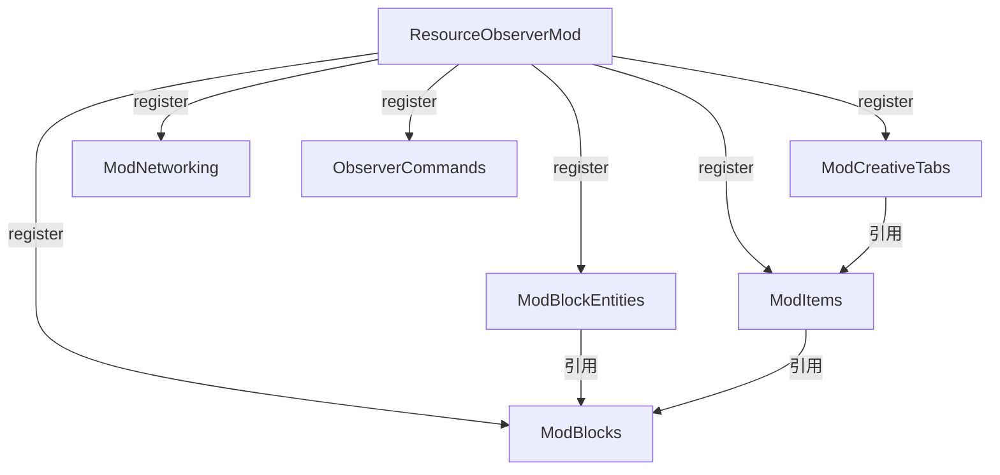

---
tags:
  - 注册
  - NeoForge
aliases:
  - 注册系统
  - DeferredRegister
---

# 注册系统

## 概述

项目使用 NeoForge 的 **DeferredRegister** 模式进行所有游戏对象注册。每个注册类别独立一个类，统一在模组入口 `ResourceObserverMod` 构造函数中注册到事件总线。

```java
// ResourceObserverMod 构造函数
public ResourceObserverMod(IEventBus modEventBus, ModContainer modContainer) {
    ModBlocks.register(modEventBus);
    ModItems.register(modEventBus);
    ModBlockEntities.register(modEventBus);
    ModCreativeTabs.register(modEventBus);
    ModNetworking.register(modEventBus);
    ObserverCommands.register();
    // 客户端...
}
```

---

## 注册类一览

### ModBlocks

**类路径：** `registry.ModBlocks`

| 注册项 | 类型 | 说明 |
|--------|------|------|
| `OBSERVER_BLOCK` | `DeferredBlock<ObserverBlock>` | 观察者方块 |

```java
public static final DeferredRegister.Blocks BLOCKS = DeferredRegister.createBlocks(MODID);

public static final DeferredBlock<ObserverBlock> OBSERVER_BLOCK =
    BLOCKS.register("observer_block", () -> new ObserverBlock(
        BlockBehaviour.Properties.of()
            // ... 方块属性
    ));

public static void register(IEventBus bus) { BLOCKS.register(bus); }
```

详见 → [[03-方块与实体]]

---

### ModItems

**类路径：** `registry.ModItems`

| 注册项 | 类型 | 说明 |
|--------|------|------|
| `BINDING_TOOL` | `DeferredItem<BindingToolItem>` | 绑定工具 |
| `RESOURCE_TERMINAL` | `DeferredItem<ResourceTerminalItem>` | 资源终端 |
| `DEBUG_TERMINAL` | `DeferredItem<DebugTerminalItem>` | 调试终端 |
| `OBSERVER_BLOCK_ITEM` | `DeferredItem<BlockItem>` | 观察者方块物品 |

```java
public static final DeferredRegister.Items ITEMS = DeferredRegister.createItems(MODID);

public static final DeferredItem<BindingToolItem> BINDING_TOOL =
    ITEMS.register("binding_tool", () -> new BindingToolItem(
        new Item.Properties().stacksTo(1)
    ));

public static void register(IEventBus bus) { ITEMS.register(bus); }
```

详见 → [[04-物品系统]]

---

### ModBlockEntities

**类路径：** `registry.ModBlockEntities`

| 注册项 | 类型 | 说明 |
|--------|------|------|
| `OBSERVER_BLOCK_ENTITY` | `DeferredHolder<BlockEntityType<?>, BlockEntityType<ObserverBlockEntity>>` | 观察者方块实体 |

```java
public static final DeferredRegister<BlockEntityType<?>> BLOCK_ENTITY_TYPES =
    DeferredRegister.create(BuiltInRegistries.BLOCK_ENTITY_TYPE, MODID);

public static final DeferredHolder<...> OBSERVER_BLOCK_ENTITY =
    BLOCK_ENTITY_TYPES.register("observer_block_entity",
        () -> BlockEntityType.Builder.of(
            ObserverBlockEntity::new, ModBlocks.OBSERVER_BLOCK.get()
        ).build(null));

public static void register(IEventBus bus) { BLOCK_ENTITY_TYPES.register(bus); }
```

详见 → [[03-方块与实体]]

---

### ModCreativeTabs

**类路径：** `registry.ModCreativeTabs`

注册自定义创造模式标签页，包含所有模组物品。

---

### ModNetworking

**类路径：** `network.ModNetworking`

虽然不是 DeferredRegister，但遵循相同的注册模式：

```java
public static void register(IEventBus bus) {
    bus.addListener(ModNetworking::onRegisterPayloads);
}
```

详见 → [[05-网络通信]]

---

### ObserverCommands

**类路径：** `world.command.ObserverCommands`

注册调试命令，通过 NeoForge 事件总线监听 `RegisterCommandsEvent`。

---

## 注册模式约定

1. **每个类别一个类**：方块、物品、方块实体、创造标签页各一个注册类
2. **静态 `register(IEventBus)` 方法**：统一的注册入口
3. **DeferredRegister 声明**：类级静态 final 字段
4. **注册项声明**：`DeferredBlock` / `DeferredItem` / `DeferredHolder` 类型
5. **所有注册在构造函数完成**：无延迟注册或动态注册

> 添加新的方块/物品时，在对应注册类中添加 `register()` 调用，无需修改模组入口类。

---

## 注册依赖关系



参见：
- [[02-系统架构]] — 模组入口和初始化流程
- [[03-方块与实体]] — 方块和方块实体实现
- [[04-物品系统]] — 物品实现
- [[05-网络通信]] — Payload 注册
